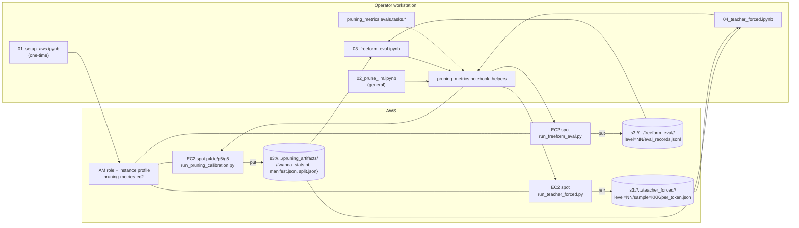

# Architecture

This page explains how the four notebooks, the EC2 GPU runners, and the
`pruning_metrics` Python library fit together. If you are new to the
project, read [`getting_started.md`](getting_started.md) first; this page
is the deeper reference.

## High-level flow



The notebooks are pure orchestration; the GPU compute always runs on a
spot EC2 instance bootstrapped through user-data. Artifacts are persisted
to S3 and downstream notebooks fetch them by URI -- there is **no**
operator-side state outside the notebooks.

## Why this shape

We pivoted to a self-contained EC2 GPU runner per phase because:

* SageMaker GPU-endpoint quota in this account is `0` for every instance
  large enough to host a 72 B-parameter model in bf16;
* the workstation has no GPU, so a "prune locally + push 5x ~145 GiB to
  S3" approach was infeasible.

The GPU box runs under its own IAM instance profile, so the experiment
proceeds even after the operator's SSO token expires.

## Pruning artifact: WANDA calibration stats only

We deliberately persist a **tiny** pruning artifact (~tens of MB):

* `wanda_stats.pt` -- per-input-channel RMS for every `nn.Linear` layer.
* `manifest.json` -- model id, dataset spec, seeds, package versions.
* `split.json` -- the audited train/test partition (native splits when
  the dataset has both, otherwise the seeded 80/20 fallback).

Downstream notebooks reload the base model and re-derive pruned weights
deterministically per level by re-applying the per-row WANDA scoring
defined in [`infra/runners/_runner_common.py`](../infra/runners/_runner_common.py).
Trade-offs:

* +cheap S3 storage (no need to keep ~720 GiB of pruned 72 B checkpoints);
* +flexible: downstream notebooks can evaluate at *any* level subset, even
  ones not in the calibration manifest;
* -slower downstream startup: each downstream run reloads + reshards the
  base model, ~5-10 min on `p4de.24xlarge` for Qwen2-72B.

## Repo layout

```
pruning-metrics/
├── notebooks/
│   ├── aws_tutorial/                 # 4-notebook AWS orchestration tutorial
│   │   ├── 01_setup_aws.ipynb        # one-time AWS bootstrap
│   │   ├── 02_prune_llm.ipynb        # produces wanda_stats.pt + manifest
│   │   ├── 03_freeform_eval.ipynb    # greedy generation + verifier per level
│   │   └── 04_teacher_forced.ipynb   # per-token log-probs per level
│   └── experiment/                   # 9-notebook local analysis pipeline
│       ├── 01_prune_all.ipynb        # v1: prune Qwen2-72B across 3 calibration domains
│       ├── 02_eval_all.ipynb         # v1: teacher-forced + free-form eval per variant
│       ├── 03_collect_results.ipynb  # assemble per-run results into tables
│       ├── ...
│       ├── 07_diagnosticity.ipynb    # v2 stratified diagnosticity analysis
│       ├── 08_distribution_metrics.ipynb  # cross-compares all 16 distances
│       └── 09_reducer_sweep.ipynb    # 16 distances x 14 reducers, full cross product
├── src/pruning_metrics/
│   ├── notebook_helpers/             # notebook-side orchestration package
│   │   ├── launch.py                 # find_capacity / launch_runner (+ fallback)
│   │   ├── polling.py                # wait_for_artifact / wait_for_runner_completion
│   │   └── util.py                   # list_results / run-id + JSON helpers
│   ├── dim_reduction/                # 14 dimensionality reducers, one module each + registry
│   │   ├── base.py                   # SPEC / fit contract shared by every reducer
│   │   ├── tsne.py, umap.py, isomap.py, pca.py, ...  # one module per algorithm
│   │   └── registry.py               # REDUCERS / embed_2d()
│   ├── prob_measures/                # 16 distributional distances, one module each + registry
│   │   ├── base.py                   # per-module contract, shared representation notes
│   │   ├── kld.py, jsd.py, emd.py, chamfer.py, ...  # one module per measure
│   │   └── registry.py               # METRIC_FUNCS / METRIC_INFO / compute_all()
│   ├── metrics/                      # aggregator: re-exports the two packages above + mask/cluster stats
│   │   ├── masks.py                  # pruning-mask extraction, digests, Jaccard distance
│   │   ├── cluster_stats.py          # Mantel, ARI, silhouette, permutation tests
│   │   ├── embedding_quality.py      # trustworthiness, continuity, stress, Shepard rho
│   │   └── distributions.py          # backwards-compatible facade over prob_measures
│   └── evals/
│       ├── tasks/                    # TaskAdapter contract + 5 concrete adapters
│       │   ├── base.py               # Protocol, TaskRecord, native_or_seeded_split
│       │   ├── coding.py             # HumanEval+ + MBPP+ adapters (seeded 80/20 fallback)
│       │   ├── math.py               # GSM8K numeric-answer adapter (native splits)
│       │   ├── mcq.py                # ARC-Challenge + MathQA adapters (native splits)
│       │   └── registry.py           # build_adapter_from_spec()
│       └── coding/                   # HumanEval+ loader, verifier, TF helper
│           ├── humaneval_plus_dataset.py
│           ├── verifier.py
│           └── teacher_forcing.py
├── infra/
│   ├── provisioning/                 # operator-side: AWS setup + launch
│   │   ├── bootstrap_ec2_resources.py  # runs from notebook 1
│   │   ├── find_capacity.py          # spot-price probe
│   │   ├── launch_gpu_instance.py    # tarball + AMI + RunInstances
│   │   └── userdata_bootstrap.sh     # cloud-init template
│   └── runners/                      # executed on the GPU (or CPU) instance
│       ├── _runner_common.py         # WANDA + S3 helpers shared by all 5 runners
│       ├── run_pruning_calibration.py# notebook 2's worker
│       ├── run_freeform_eval.py      # notebook 3's worker
│       ├── run_teacher_forced.py     # notebook 4's worker
│       ├── run_prune_eval_sweep.py   # notebook 6's worker (v2 prune + eval sweep)
│       └── run_v2_analysis.py        # notebook 7's worker (CPU diagnosticity analysis)
├── scripts/
│   └── build_notebooks.py            # regenerates the 4 notebooks in notebooks/aws_tutorial/
├── docs/                             # this folder
└── tests/                            # pytest suite
```

## Lifecycle of a single experiment

1. **Notebook 2 - calibration.** The operator picks `BASE_MODEL_ID`,
   `CALIBRATION_DATASET_SPEC`, `PRUNING_LEVELS`, and seeds. The notebook
   shells to [`infra/provisioning/find_capacity.py`](../infra/provisioning/find_capacity.py)
   to pick a GPU spot AZ, then to
   [`infra/provisioning/launch_gpu_instance.py`](../infra/provisioning/launch_gpu_instance.py)
   to tar the repo, upload it to S3, resolve the latest Deep Learning AMI,
   and call `RunInstances` with the user-data template
   [`infra/provisioning/userdata_bootstrap.sh`](../infra/provisioning/userdata_bootstrap.sh)
   rendered for the **calibration** runner.
2. **GPU runs.** The user-data probes the DLAMI's pre-installed PyTorch
   conda env, falls back to system pip if needed, runs
   [`infra/runners/run_pruning_calibration.py`](../infra/runners/run_pruning_calibration.py),
   which loads the base model once, collects WANDA activation stats over
   the calibration split, writes `wanda_stats.pt` + `manifest.json` +
   `split.json`, syncs to S3, and shuts down the instance.
3. **Notebook 3 - free-form eval.** With the artifact URI from step 2, the
   operator chooses an `EVAL_DATASET_SPEC` (may differ from calibration --
   for example calibrate on HumanEval+, evaluate on GSM8K) and an
   `EVAL_LEVELS` subset. Notebook 3 launches a second GPU box that runs
   [`infra/runners/run_freeform_eval.py`](../infra/runners/run_freeform_eval.py),
   which downloads the artifact, loads the model, and per level: restore
   weights -> apply per-row WANDA from stats -> generate test split greedily
   -> task-adapter verify -> sync `level=NN/eval_records.jsonl` + a rolling
   `summary.json`.
4. **Notebook 4 - teacher-forced log-probs.** Same artifact, same shape.
   The runner picks `NUM_TF_SAMPLES` test records deterministically using
   `TF_SEED`, and for each level runs one teacher-forced forward pass per
   record -> `level=NN/sample=KKK_task=.../per_token.json`. The notebook
   downloads the JSONs and renders a per-token dataframe + a per-level
   summary plot.

## Determinism

Every random source is seeded:

* the seeded train/test fallback when a dataset has only one native
  split (HumanEval+; `SPLIT_SEED`, default `65320`);
* the calibration sample selection cap (`MAX_CALIBRATION_SAMPLES`,
  applied via a `SPLIT_SEED`-keyed shuffle so a cap over a 7473-row
  GSM8K train set still picks the same N rows on every run);
* `torch.manual_seed` on every generation step (`GENERATION_SEED`);
* the teacher-forced sample selection (`TF_SEED`).

Native-split datasets (GSM8K, ARC) keep the Hugging Face row order for
the partition itself and ignore `SPLIT_SEED` / `TRAIN_FRAC`; see
[`docs/tasks.md`](tasks.md#train-test-and-validation-splits) for the full
native-vs-seeded split contract. `split.json` records the full ordered
task-id partition either way for review. All runner-side seeds are
forwarded via env vars and recorded in `run_metadata.json` next to the
artifacts.

## Where to extend

* **Add a new task** -> [`docs/tasks.md`](tasks.md). 30 minutes of work for
  a new adapter; the registry ties it together.
* **Add a new metric** -> extend the relevant runner, since metrics live
  alongside `verify` (free-form) or `compute_teacher_forced_logprobs` (TF).
* **Bigger / smaller models** -> change `BASE_MODEL_ID` in notebook 2.
  The runner handles the `device_map='auto'` sharding automatically.
* **Different datasets per phase** -> set `CALIBRATION_DATASET_SPEC` in
  notebook 2 to one task, `EVAL_DATASET_SPEC` in notebooks 3 and 4 to
  another. Calibrate on coding, evaluate on math, etc.

## Cost & wall-clock reference (May 2026 prices)

The full Qwen2-72B sweep across notebooks 2-4 costs ~$25 of spot GPU time
(a small-model smoke pass is well under $0.50); see
[infra/README.md](../infra/README.md#cost--wall-clock-reference-may-2026-prices)
for the phase-by-phase wall-clock and price breakdown.
